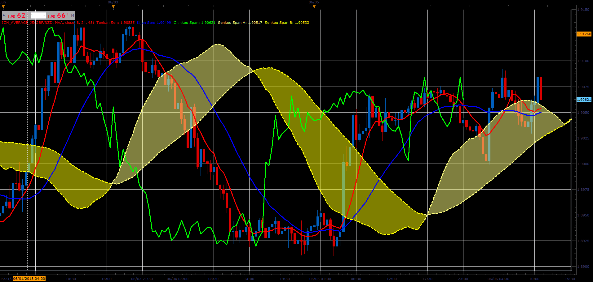

# Ichimoku Moving Average

> Source: https://fxcodebase.com/code/viewtopic.php?f=48&t=66546  
> Forum: 48 · Topic 66546 · 1 post(s)

---

## Ichimoku Moving Average

**Alexander.Gettinger** · Sat Aug 18, 2018 9:21 pm

Ichimoku with moving averages in place of mid-channel.

 

Download:

 [Ich_Average_JS.jsl](files/120649/Ich_Average_JS.jsl)

For this indicator must be installed Averages indicator ([viewtopic.php?f=17&t=2430](https://fxcodebase.com/code/viewtopic.php?f=17&t=2430)).
