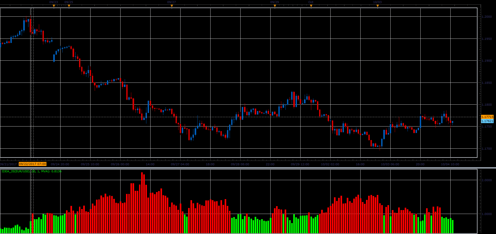

# Idea Trend oscillator

> Source: https://fxcodebase.com/code/viewtopic.php?f=48&t=65216  
> Forum: 48 · Topic 65216 · 1 post(s)

---

## Idea Trend oscillator

**Alexander.Gettinger** · Sat Oct 28, 2017 8:58 am

Formulas:
Idea = (MA_H-MA_C)/(MA_C-MA_L), where
MA_H = MA(High) with [Length] number of periods and [Method] type,
MA_L = MA(Low) with [Length] number of periods and [Method] type,
MA_C = MA(Close) with [Length] number of periods and [Method] type.

 

Download:

 [Idea_JS.jsl](files/115640/Idea_JS.jsl)
