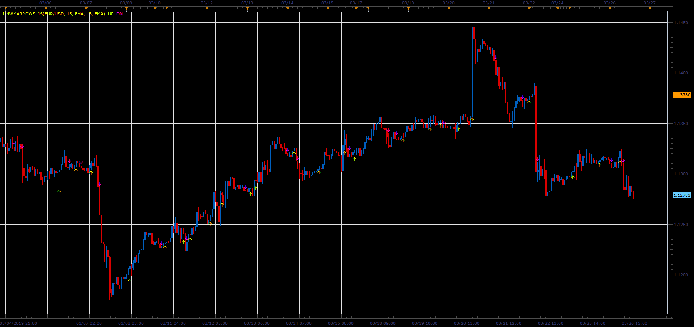

# IINWMARROWS indicator

> Source: https://fxcodebase.com/code/viewtopic.php?f=48&t=68267  
> Forum: 48 · Topic 68267 · 1 post(s)

---

## IINWMARROWS indicator

**Alexander.Gettinger** · Sat Mar 30, 2019 3:38 pm

The indicator uses the fast and slow MA.
If FastMA[i-1]>SlowMA[i-1] and FastMA[i-2]<SlowMA[i-2] and FastMA[i]>SlowMA[i] - UP arrow
If FastMA[i-1]<SlowMA[i-1] and FastMA[i-2]>SlowMA[i-2] and FastMA[i]<SlowMA[i] - DN arrow
Fast MA is calculated for close price and slow MA is calculated for open price.

 

Download:

 [IINWMARROWS_JS.jsl](files/125487/IINWMARROWS_JS.jsl)

For this indicator must be installed Averages indicator ([viewtopic.php?f=17&t=2430](https://fxcodebase.com/code/viewtopic.php?f=17&t=2430)).
