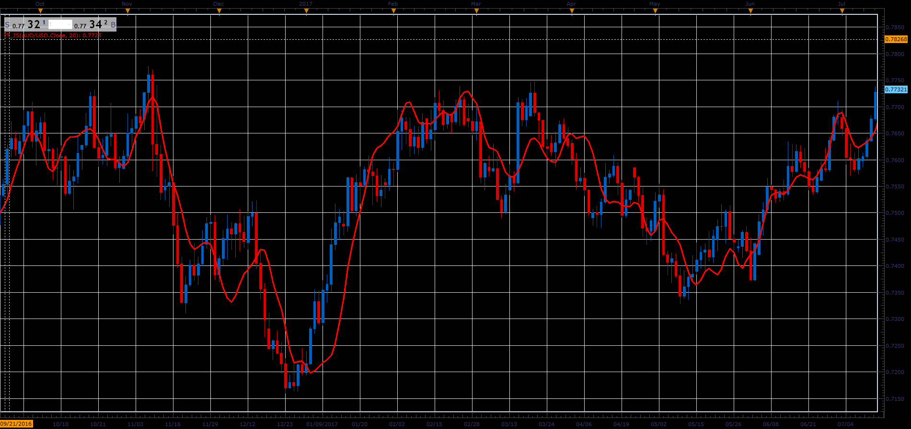

# Instantaneous Trendline

> Source: https://fxcodebase.com/code/viewtopic.php?f=48&t=66040  
> Forum: 48 · Topic 66040 · 1 post(s)

---

## Instantaneous Trendline

**Alexander.Gettinger** · Wed May 02, 2018 11:34 am

As described in an article by John Ehlers' article "Modeling
The Market = Building Trading Strategies "
August 2006 of S & C Magazine

Formulas:
Instantaneous Trendline = MVA(Price, Length)+SmoothSlope/2, where
SmoothSlope[i] = (Slope[i]+2*Slope[i-1]+2*Slope[i-2]+Slope[i-3])/6,
Slope[i] = Price[i]-Price[i-Length+1].

 

Download:

 [IT_JS.jsl](files/118991/IT_JS.jsl)
