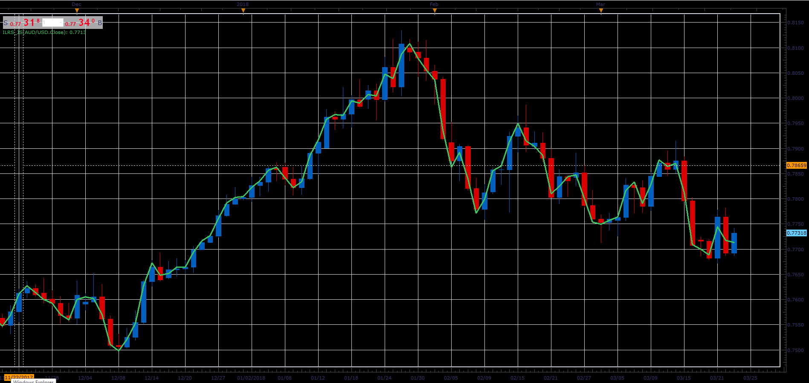

# Integral of Linear Regression Slope

> Source: https://fxcodebase.com/code/viewtopic.php?f=48&t=66037  
> Forum: 48 · Topic 66037 · 1 post(s)

---

## Integral of Linear Regression Slope

**Alexander.Gettinger** · Wed May 02, 2018 11:30 am

Formula:
ILRS[i]=(N*Sum1-Sum*Sumy)/(Sum*Sum-N*Sum2)+MVA(I,N), where
Sum=N*(N-1)*0.5,
Sum2=N*(N-1)*(2*N-1)/6,
Sum1=1*Price[i-1]+2*Price[i-2]+…+(N-1)*Price[i-N+1],
Sumy=Price[i]+Price[i-1]+…+Price[i-N+1],
MVA(i,N) – Simple Moving Average.

 

Download:

 [ILRS_JS.jsl](files/118988/ILRS_JS.jsl)
