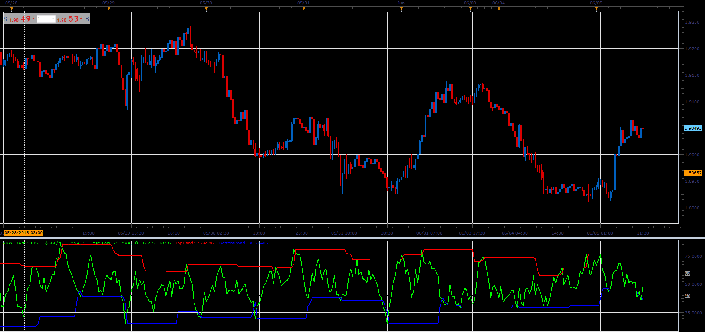

# Internal Bar Strength bands

> Source: https://fxcodebase.com/code/viewtopic.php?f=48&t=66459  
> Forum: 48 · Topic 66459 · 1 post(s)

---

## Internal Bar Strength bands

**Alexander.Gettinger** · Tue Aug 07, 2018 12:01 pm

Formula:
IBS=MA(CurIBS), where
CurIBS=100*(Close-Low)/Range, if [Price]="Close-Low",
CurIBS=100*(High-Close)/Range, if [Price]="High-Close", where
Range=High-Low.

 

Download:

 [VKW_BandsIBS_JS.jsl](files/120416/VKW_BandsIBS_JS.jsl)
