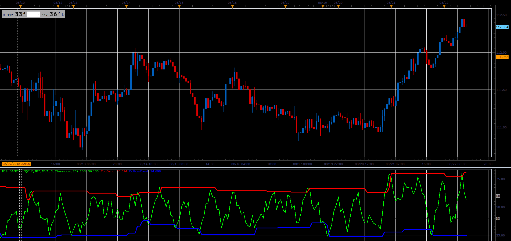

# Internal Bar Strength with bands

> Source: https://fxcodebase.com/code/viewtopic.php?f=48&t=66976  
> Forum: 48 · Topic 66976 · 1 post(s)

---

## Internal Bar Strength with bands

**Alexander.Gettinger** · Sat Nov 24, 2018 1:18 pm

Bands is a minimum and maximum of IBS at [Extremum Period] previous candles.

 

Download:

 [IBS_Bands_JS.jsl](files/122305/IBS_Bands_JS.jsl)

For this indicator must be installed Averages indicator ([viewtopic.php?f=17&t=2430](https://fxcodebase.com/code/viewtopic.php?f=17&t=2430)).
