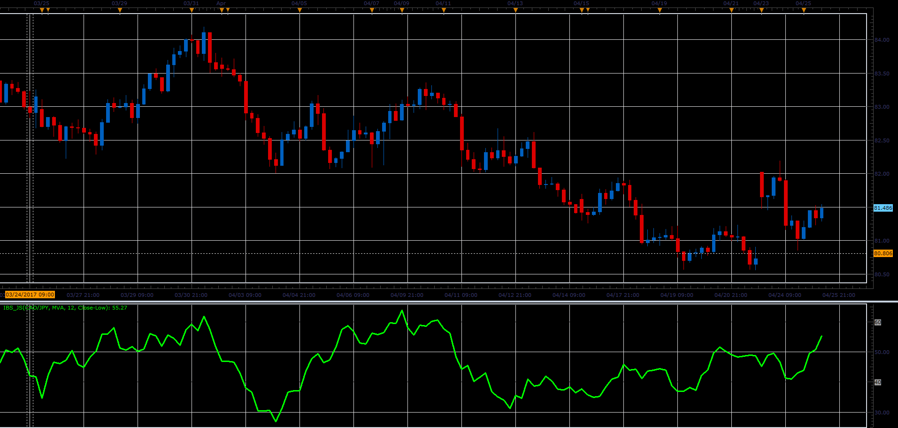

# Internal Bar Strength

> Source: https://fxcodebase.com/code/viewtopic.php?f=48&t=64796  
> Forum: 48 · Topic 64796 · 1 post(s)

---

## Internal Bar Strength

**Alexander.Gettinger** · Wed Jun 14, 2017 11:08 am

Formula:
IBS=MA(CurIBS), where
CurIBS=100*(Close-Low)/Range, if [Price]="Close-Low",
CurIBS=100*(High-Close)/Range, if [Price]="High-Close", where
Range=High-Low.

 

Download:

 [IBS_JS.jsl](files/112889/IBS_JS.jsl)
