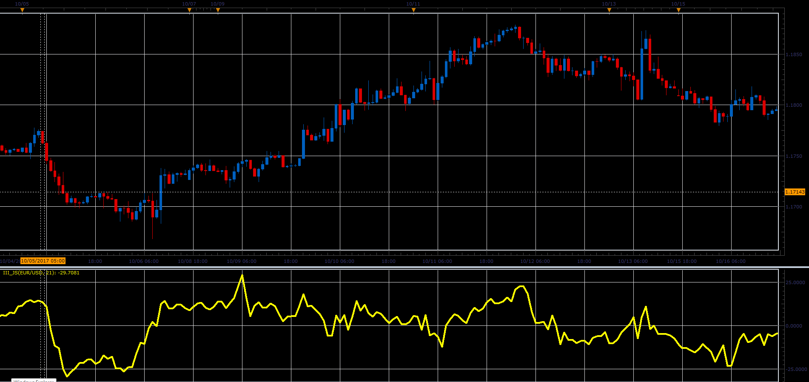

# Intraday Intensity

> Source: https://fxcodebase.com/code/viewtopic.php?f=48&t=65550  
> Forum: 48 · Topic 65550 · 1 post(s)

---

## Intraday Intensity

**Alexander.Gettinger** · Sat Jan 06, 2018 2:54 pm

Formula:
II = Sum ((2C-H-L)/(H-L))xV
III = (II / Sum(V)) x 100
Signal = MA of III

 

Download:

 [III_JS.jsl](files/116829/III_JS.jsl)
