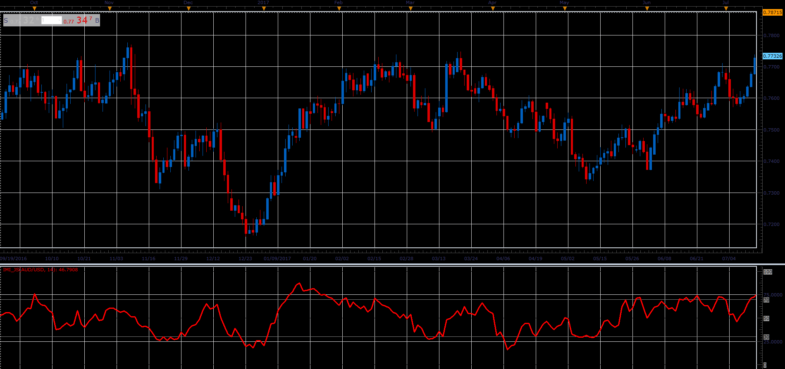

# Intraday Momentum Index

> Source: https://fxcodebase.com/code/viewtopic.php?f=48&t=66039  
> Forum: 48 · Topic 66039 · 1 post(s)

---

## Intraday Momentum Index

**Alexander.Gettinger** · Wed May 02, 2018 11:32 am

Meaures the percentage of the underlying symbol upwards price change to its total price change during a specified number of periods.

Formula:
IMI = 100*U/(U+D), where
U = MVA(Up),
D = MVA(Down),
Up[i] = Close[i]-Open[i], if Close[i]>Open[i], else Up[i] = 0,
Down[i] = Open[i]-Close[i], if Close[i]<Open[i], else Down[i]=0.

 

Download:

 [IMI_JS.jsl](files/118990/IMI_JS.jsl)
