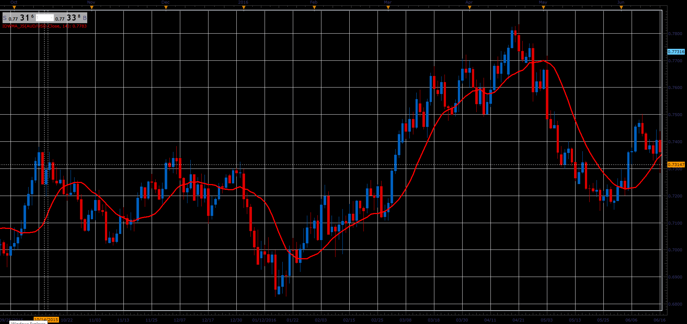

# Inverse Distance Weighted Moving Average

> Source: https://fxcodebase.com/code/viewtopic.php?f=48&t=66036  
> Forum: 48 · Topic 66036 · 1 post(s)

---

## Inverse Distance Weighted Moving Average

**Alexander.Gettinger** · Wed May 02, 2018 11:28 am

This multi-timeframe capable moving average discounts prices far from the average.

 

Download:

 [IDWMA_JS.jsl](files/118987/IDWMA_JS.jsl)
