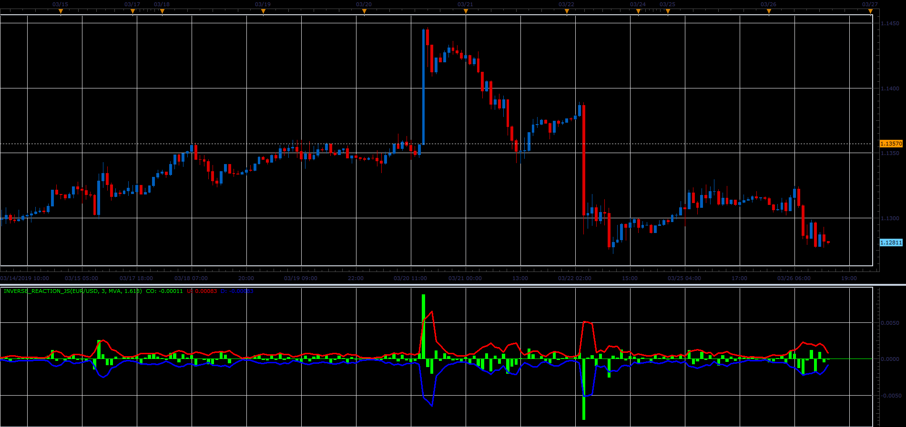

# Inverse reaction oscillator

> Source: https://fxcodebase.com/code/viewtopic.php?f=48&t=68228  
> Forum: 48 · Topic 68228 · 1 post(s)

---

## Inverse reaction oscillator

**Alexander.Gettinger** · Sat Mar 30, 2019 12:04 pm

Formulas:
CO[i] = Close[i]-Open[i],
U[i] = Coeff(MA(Abs(CO))),
D[i] = -U[i].

 

Download:

 [Inverse_Reaction_JS.jsl](files/125447/Inverse_Reaction_JS.jsl)

For this indicator must be installed Averages indicator ([viewtopic.php?f=17&t=2430](https://fxcodebase.com/code/viewtopic.php?f=17&t=2430)).
