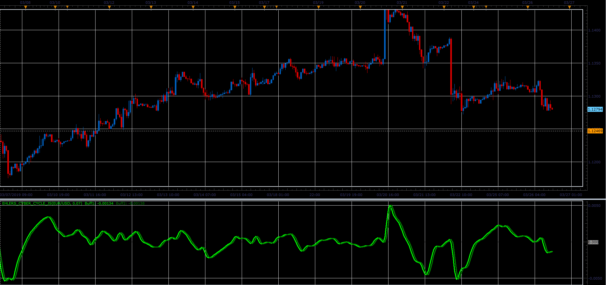
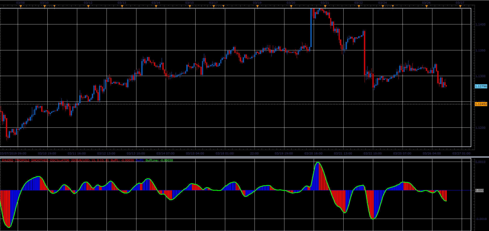

# John Ehler's indicators

> Source: https://fxcodebase.com/code/viewtopic.php?f=48&t=68215  
> Forum: 48 · Topic 68215 · 1 post(s)

---

## John Ehler's indicators

**Alexander.Gettinger** · Sat Mar 30, 2019 11:44 am

Original researches by John F. Ehlers, described in "Cybernetic Analysis for Stocks and Futures" (2004) ISBN: 0-471-46307-8

**Cyber cycle indicator:**

 

Download:

 [Ehlers_Cyber_Cycle_JS.jsl](files/125434/Ehlers_Cyber_Cycle_JS.jsl)

**TwoPole smoothes oscillator:**

 

Download:

 [Ehlers_TwoPole_Smoothed_Oscillator_JS.jsl](files/125434/Ehlers_TwoPole_Smoothed_Oscillator_JS.jsl)
