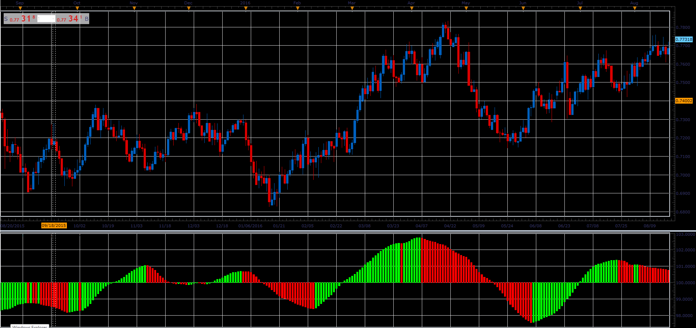

# Kairi (KMAMA)

> Source: https://fxcodebase.com/code/viewtopic.php?f=48&t=66044  
> Forum: 48 · Topic 66044 · 1 post(s)

---

## Kairi (KMAMA)

**Alexander.Gettinger** · Wed May 02, 2018 11:40 am

This indicator is a derivative of the standard indicators, KRI.

Formula:
KMAMA = 100*Short_MVA/Long_MVA-100, where
Short_MVA = MVA(Close price) with [Short_Length] number of periods,
Long_MVA = MVA(Close price) with [Long_Length] number of periods.

 

Download:

 [KMAMA_JS.jsl](files/118995/KMAMA_JS.jsl)
