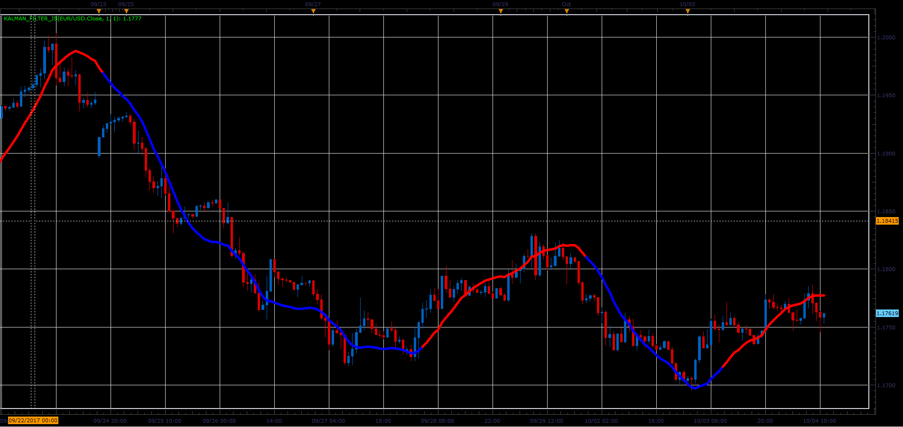

# Kalman filter

> Source: https://fxcodebase.com/code/viewtopic.php?f=48&t=65217  
> Forum: 48 · Topic 65217 · 1 post(s)

---

## Kalman filter

**Alexander.Gettinger** · Sat Oct 28, 2017 9:08 am

The indicator implements Kalman filter ([https://en.wikipedia.org/wiki/Kalman_filter](https://en.wikipedia.org/wiki/Kalman_filter))

Formulas:
Kalman[i]=Error+Velocity[i], where
Error=Kalman[i-1]+Distance*ShK,
Velocity[i]=Velocity[i-1]+Distance*K/100,
Distance=Price[i]-Kalman[i-1],
ShK=sqrt(Sharpness*K/100).

if Velocity>0, Kalman have a UP color and if Velocity<0, Kalman have a DN color.

 

Download:

 [Kalman_Filter_JS.jsl](files/115641/Kalman_Filter_JS.jsl)
