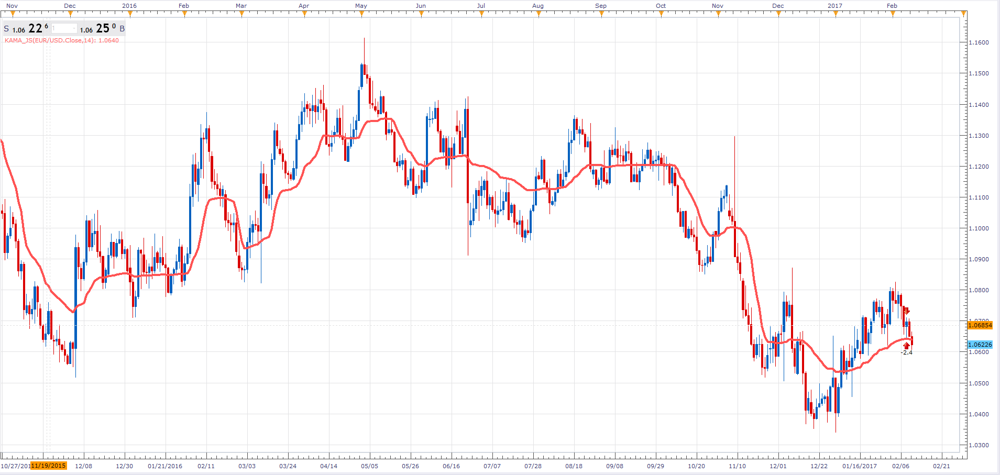

# Kaufman Adaptive Moving Average

> Source: https://fxcodebase.com/code/viewtopic.php?f=48&t=64441  
> Forum: 48 · Topic 64441 · 1 post(s)

---

## Kaufman Adaptive Moving Average

**Alexander.Gettinger** · Fri Feb 10, 2017 7:55 pm

Kaufman Adaptive Moving Average (KAMA).

 

Download:

 [KAMA_JS.jsl](files/111008/KAMA_JS.jsl)
