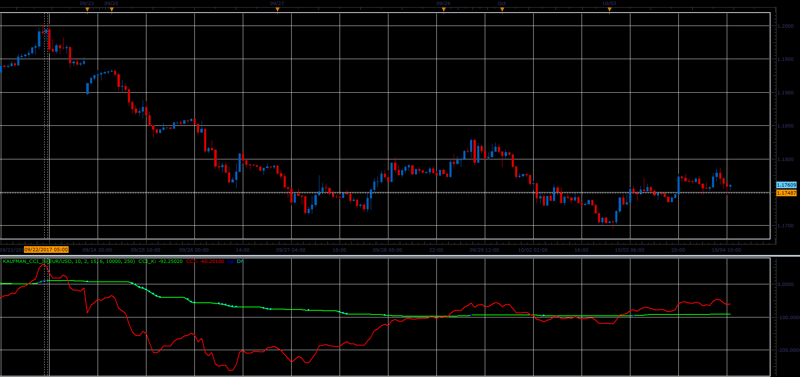
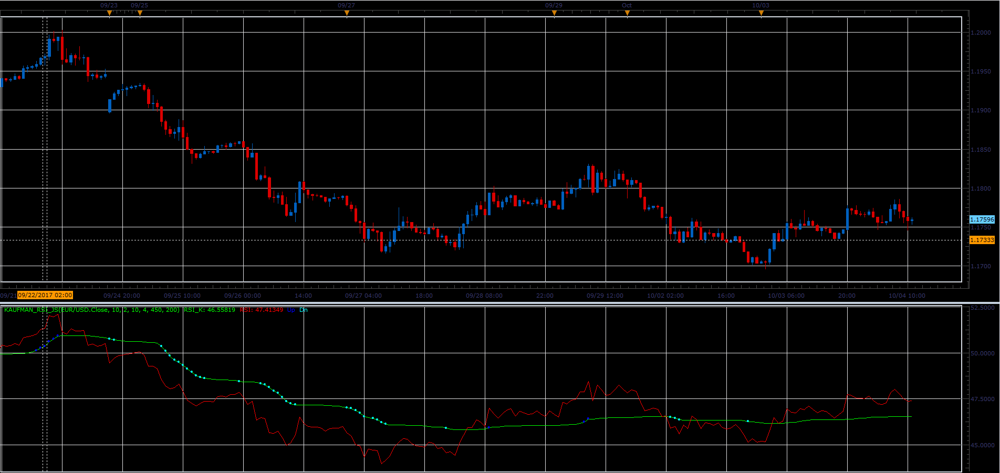
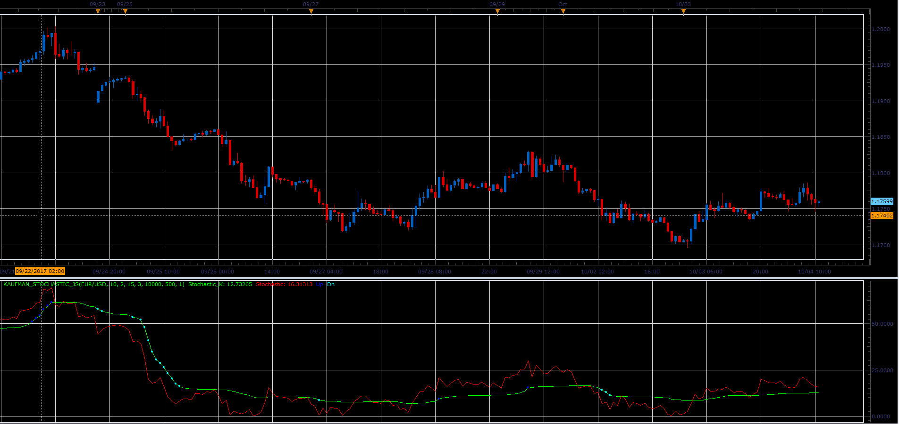

# Kaufman RSI,CCI and Stochastic

> Source: https://fxcodebase.com/code/viewtopic.php?f=48&t=65218  
> Forum: 48 · Topic 65218 · 1 post(s)

---

## Kaufman RSI,CCI and Stochastic

**Alexander.Gettinger** · Sat Oct 28, 2017 9:12 am

Developed by Perry Kaufman, this indicators using an Efficiency Ratio to modify the smoothing constant, which ranges from a minimum of Fast Length to a maximum of Slow Length.

Formulas:
Ind - indicator (CCI, RSI, Stochastic)
AMA0=Ind(current-1);
signal=Abs(Ind(current)-Ind(current-periodAMA));
noise=SUM(Abs(Ind(current-i)-Ind(current-i-1)));
ER=signal/noise;
ERSC=ER/(fast-slow);
SSC=ERSC+slow;
AMA=AMA0+SSC^G*(Ind(current)-AMA0);
Caufman_Ind=AMA;

**Kaufman CCI:**

 

Download:

 [Kaufman_CCI_JS.jsl](files/115642/Kaufman_CCI_JS.jsl)

**Kaufman RSI:**

 

Download:

 [Kaufman_RSI_JS.jsl](files/115642/Kaufman_RSI_JS.jsl)

**Kaufman Stochastic:**

 

Download:

 [Kaufman_Stochastic_JS.jsl](files/115642/Kaufman_Stochastic_JS.jsl)
