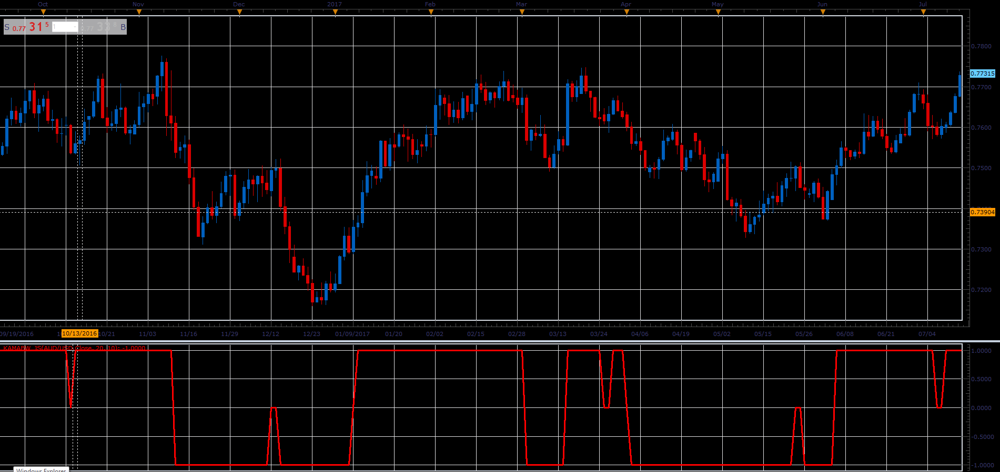

# Kaufman's Adaptive Moving Average Binary Wave

> Source: https://fxcodebase.com/code/viewtopic.php?f=48&t=66041  
> Forum: 48 · Topic 66041 · 1 post(s)

---

## Kaufman's Adaptive Moving Average Binary Wave

**Alexander.Gettinger** · Wed May 02, 2018 11:34 am

Download:

 [KAMABW_JS.jsl](files/118992/KAMABW_JS.jsl)
