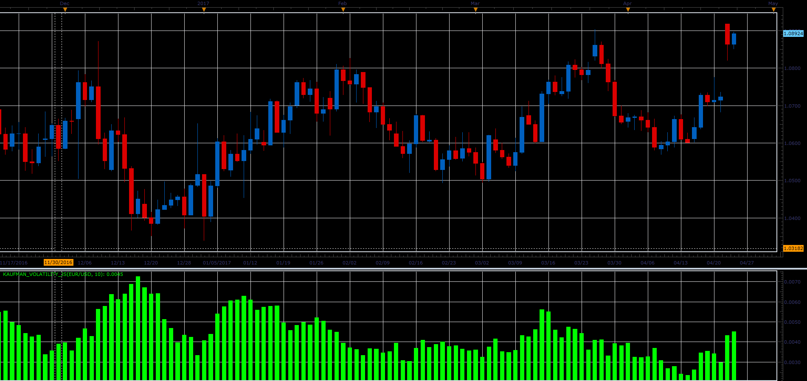

# Kaufman volatility indicator

> Source: https://fxcodebase.com/code/viewtopic.php?f=48&t=64728  
> Forum: 48 · Topic 64728 · 1 post(s)

---

## Kaufman volatility indicator

**Alexander.Gettinger** · Fri Jun 02, 2017 2:14 pm

The indicator is written according to Perry Kaufman books "Smarter Trading" and "Trading Systems & Methods".

Formulas for volatility indicator:
Volatility[i]=(DiffPrice[i]+DiffPrice[i-1]+...+DiffPrice[i-Period])/Period, where
DiffPrice[i]=Abs(close[i]-close[i-1]).

 

Download:

 [Kaufman_Volatility_JS.jsl](files/112717/Kaufman_Volatility_JS.jsl)
