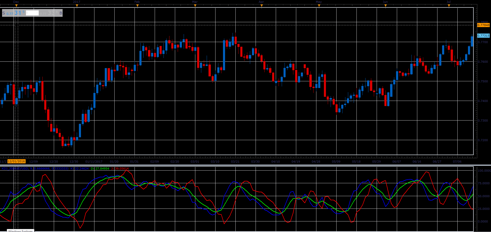
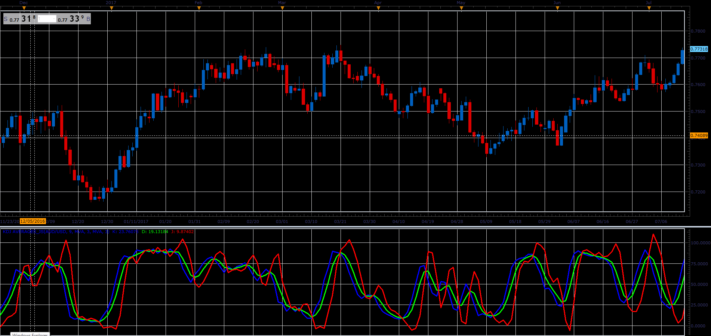

# KDJ Indicator

> Source: https://fxcodebase.com/code/viewtopic.php?f=48&t=66042  
> Forum: 48 · Topic 66042 · 1 post(s)

---

## KDJ Indicator

**Alexander.Gettinger** · Wed May 02, 2018 11:37 am

K line is :
K = ((Current Close – Lowest Low) / (Highest high – Lowest low))* 100

D is simple moving average of the K line. Usually D is 3 day simple moving average of K line but it depends on what trader wants to choose. We have used exponential average.
D = N day simple moving average of K line

‘J’ is the divergence of ‘D’ value from the ‘K’ value.
J = (3*D) – (2*K)

An example of a strategy rules:

Buy – When ‘J’ line crosses above the 50 mark
Sell – When the ‘J’ line crosses below the 50 mark

 

Download:

 [KDJ_JS.jsl](files/118993/KDJ_JS.jsl)

**KDJ Averages:**

 

Download:

 [KDJ Averages_JS.jsl](files/118993/KDJ%20Averages_JS.jsl)

For this indicator must be installed Averages indicator ([viewtopic.php?f=17&t=2430](https://fxcodebase.com/code/viewtopic.php?f=17&t=2430)).
