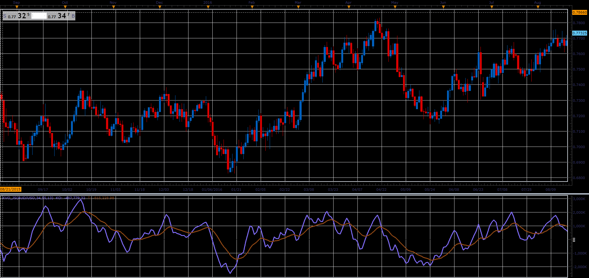

# Klinger Oscillator

> Source: https://fxcodebase.com/code/viewtopic.php?f=48&t=66046  
> Forum: 48 · Topic 66046 · 1 post(s)

---

## Klinger Oscillator

**Alexander.Gettinger** · Wed May 02, 2018 11:43 am

The description of the indicator from investopedia ([https://www.investopedia.com/terms/k/kl ... llator.asp](https://www.investopedia.com/terms/k/klingeroscillator.asp))

A technical indicator developed by Stephen Klinger that is used to determine long-term trends of money flow while remaining sensitive enough to short-term fluctuations to enable a trader to predict short-term reversals. This indicator compares the volume flowing in and out of a security to price movement, and it is then turned into an oscillator.

A signal line (13-period moving average) is used to trigger transaction decisions. This technique is very similar to signals that are created with other indicators such as the 'moving average convergence divergence'.

The Klinger Oscillator also uses divergence to identify when price and volume are not confirming the direction of the move. It is considered to be a bullish sign when the value of the indicator is heading upward while the price of the security continues to fall. Traders will use other tools such as trendlines, moving averages and other indicators to confirm the reversal.

 

Download:

 [kvo_JS.jsl](files/118997/kvo_JS.jsl)
