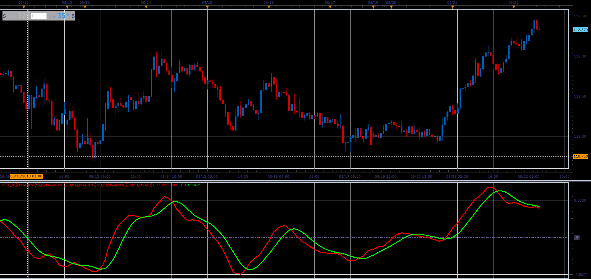
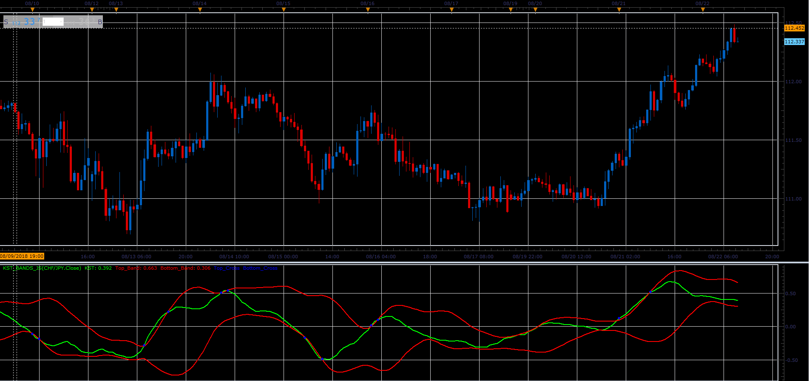

# Know Sure Thing (KST)

> Source: https://fxcodebase.com/code/viewtopic.php?f=48&t=66977  
> Forum: 48 · Topic 66977 · 1 post(s)

---

## Know Sure Thing (KST)

**Alexander.Gettinger** · Sat Nov 24, 2018 2:55 pm

The KST indicator was developed by Martin J. Pring. The name KST comes from "Know Sure Thing". The KST is constructed by summing four smoothed rates of change. For more interpretation refer to Martin Pring's article "Summed Rate of Change (KST)" in the September 92 issue of TASC.

The indicator formula is
W = R1 + R2 + R3 + R4;
KST = R1/W * MA(ROC(R1), M1) + R2/W * MA(ROC(R2), M2) + R3/W * MVA(ROC(R3), M3) + R4/W * MVA(ROC(R4), M4);
SIGNAL = MA(KST, S)

Where: R1, R2, R3, R4, M1, M2, M3, M4, S and the moving average method are the indicator's parameters.

The typical usage of the indicator is to long when signal line crosses the kst line down and to short when signal line crosses the kst line up.

 

Download:

 [kst_JS.jsl](files/122306/kst_JS.jsl)

**KST bands.**

The indicator draws a line KST, builds bands on it and show their points of intersection.

 

Download:

 [KST_Bands_JS.jsl](files/122306/KST_Bands_JS.jsl)
