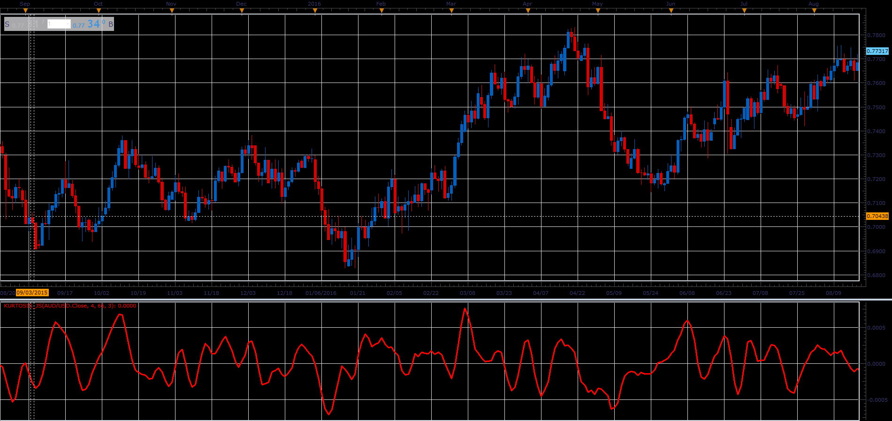

# Kurtosis

> Source: https://fxcodebase.com/code/viewtopic.php?f=48&t=66045  
> Forum: 48 · Topic 66045 · 1 post(s)

---

## Kurtosis

**Alexander.Gettinger** · Wed May 02, 2018 11:42 am

The Kurtosis is a market sentiment indicator.
The formula for the Kurtosis is as follows:

MVA(3) of EMA (66) of ( Momentum[period] - Momentum[period-1] ).

 

Download:

 [Kurtosis_JS.jsl](files/118996/Kurtosis_JS.jsl)
