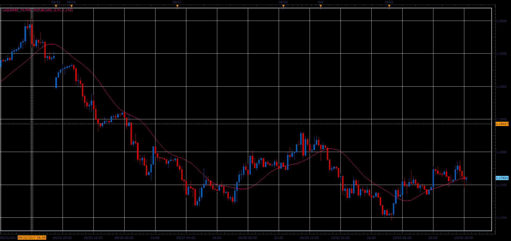
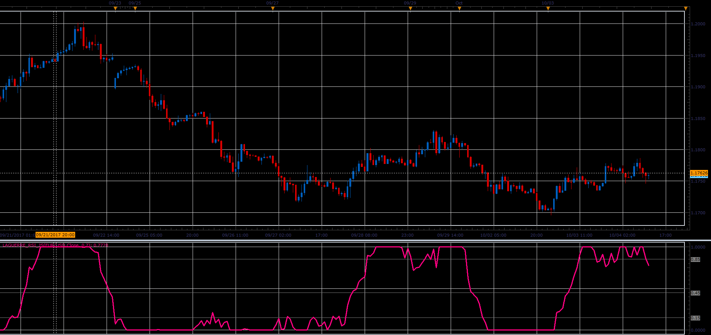
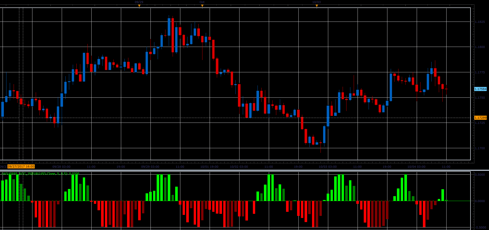
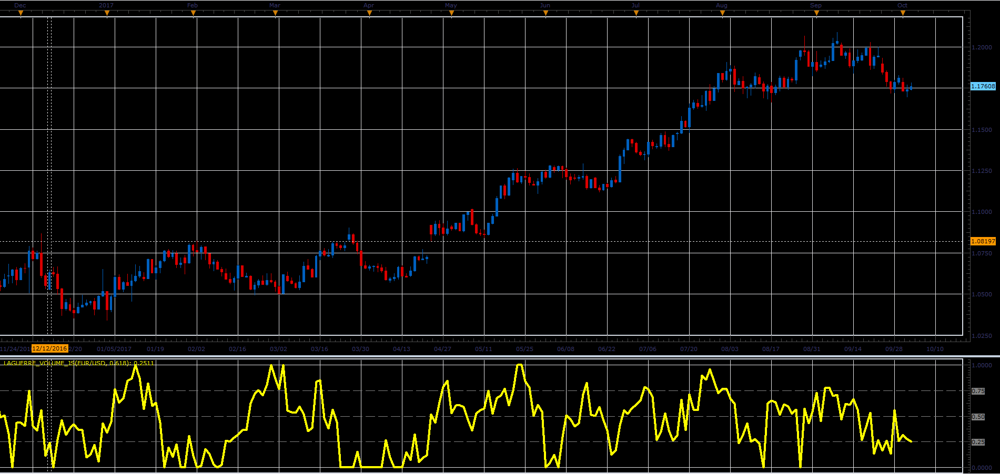

# Laguerre Relative Strength Index (RSI) and Filter

> Source: https://fxcodebase.com/code/viewtopic.php?f=48&t=65219  
> Forum: 48 · Topic 65219 · 1 post(s)

---

## Laguerre Relative Strength Index (RSI) and Filter

**Alexander.Gettinger** · Sat Oct 28, 2017 9:16 am

The Laguerre RSI was introduced by John Ehlers in his book “Cybernetic Analysis for stocks and futures”. It uses a Laguerre filter to provide a “time warp” so that the low frequency components are delayed more than the high frequency components, enabling much smoother filters to be created using less data.

The typical usage the Laguerre RSI is to buy when the line crosses 0.15 and sell when price crosses 0.85. The price damping factor can be customized for optimal use to best suit the trade instruments data by altering the gamma factor usually between 0.55 and 0.85. The lower the Gamma factor the faster more aggressive the entry. The scale is -0.5 to 1.05.

**Laguerre Filter:**

 

Download:

 [Laguerre_Filter_JS.jsl](files/115643/Laguerre_Filter_JS.jsl)

**Laguerre RSI:**

 

Download:

 [Laguerre_RSI_JS.jsl](files/115643/Laguerre_RSI_JS.jsl)

**Laguerre ROC:**

 

Download:

 [Laguerre_ROC_JS.jsl](files/115643/Laguerre_ROC_JS.jsl)

**Laguerre Volume:**

 

Download:

 [Laguerre_Volume_JS.jsl](files/115643/Laguerre_Volume_JS.jsl)
