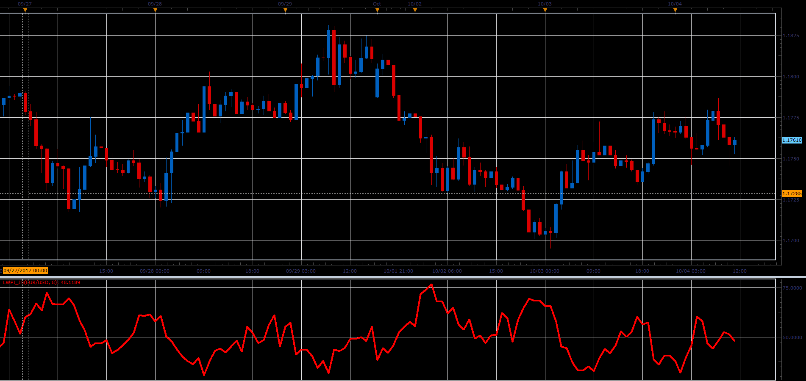

# Larry Commerical Proxy Index

> Source: https://fxcodebase.com/code/viewtopic.php?f=48&t=65230  
> Forum: 48 · Topic 65230 · 1 post(s)

---

## Larry Commerical Proxy Index

**Alexander.Gettinger** · Sat Oct 28, 2017 9:36 am

Larry Commerical Proxy Index
Larry Williams said he even dont need COT report to buil COT index. Here his formula:

MovingAvg(Open-Close, bars used in average)/MovingAvg(Range,bars used in average)*50 +50.

 

Download:

 [LWPI_JS.jsl](files/115654/LWPI_JS.jsl)
