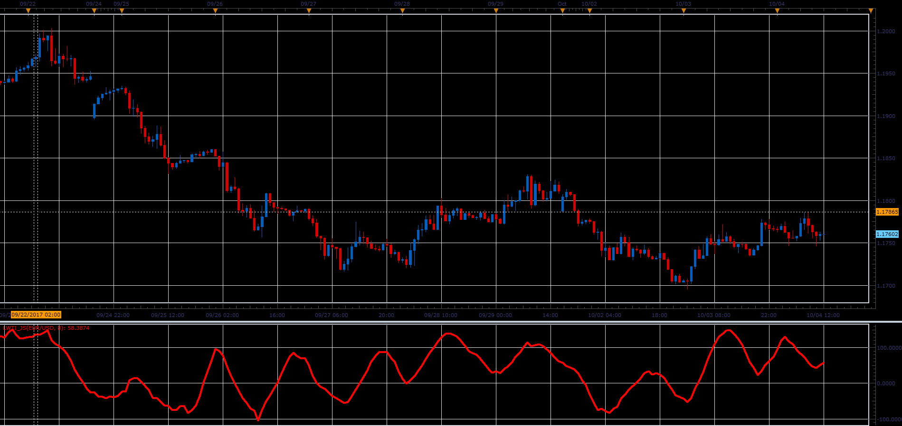

# Larry Large Trade Index

> Source: https://fxcodebase.com/code/viewtopic.php?f=48&t=65231  
> Forum: 48 · Topic 65231 · 1 post(s)

---

## Larry Large Trade Index

**Alexander.Gettinger** · Sat Oct 28, 2017 9:37 am

MovingAvg(Close - Close[Period], bars used in average)/MovingAvg(Range,bars used in average)*50 +50.

 

Download:

 [LWTI_JS.jsl](files/115655/LWTI_JS.jsl)
