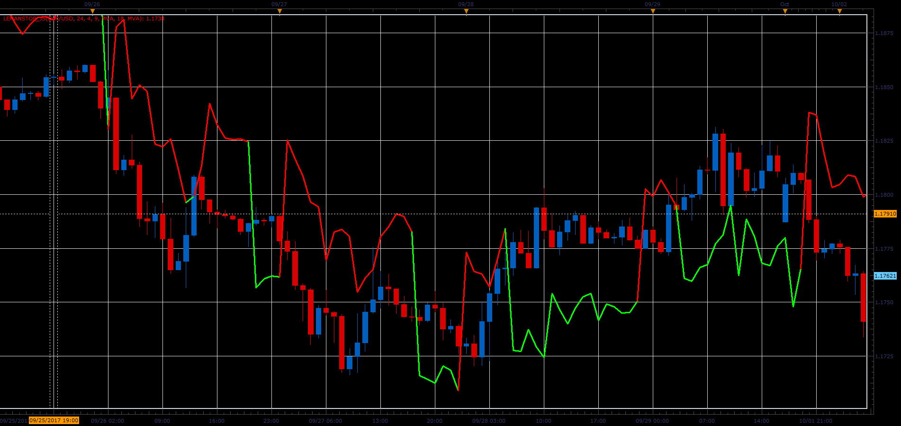

# LeMan Stop

> Source: https://fxcodebase.com/code/viewtopic.php?f=48&t=65220  
> Forum: 48 · Topic 65220 · 1 post(s)

---

## LeMan Stop

**Alexander.Gettinger** · Sat Oct 28, 2017 9:19 am

Formulas:
LeMan Stop[i] = Open[i-1]-Coeff*MVA(HO, Length), if dMA>0,
LeMan Stop[i] = Open[i-1]+Coeff*MVA(OL, Length), if dMA<0, where
HO = High-Open,
OL = Open-Low,
dMA = FastMA-SlowMA,
FastMA - MA(Close) with [Fast_MA_Length] number of periods and [Fast_MA_Method] type,
SlowMA - MA(Close) with [Slow_MA_Length] number of periods and [Slow_MA_Method] type.

 

Download:

 [LeManStop_JS.jsl](files/115644/LeManStop_JS.jsl)
