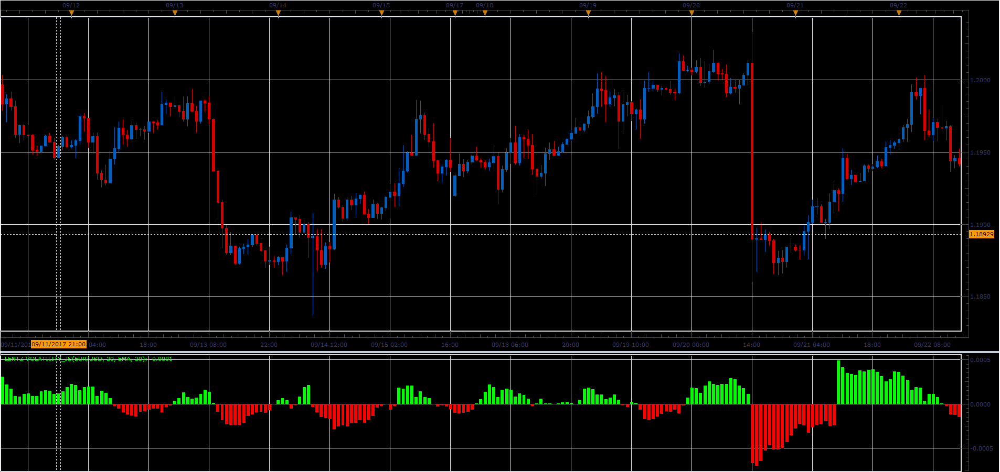

# Lentz Volatility

> Source: https://fxcodebase.com/code/viewtopic.php?f=48&t=65222  
> Forum: 48 · Topic 65222 · 1 post(s)

---

## Lentz Volatility

**Alexander.Gettinger** · Sat Oct 28, 2017 9:22 am

That is the m-period moving average of the ATR over n-period minus the ATR over n-period.
LVI = MA [ATR(n), m] - ATR(n)

 

Download:

 [Lentz Volatility_JS.jsl](files/115646/Lentz%20Volatility_JS.jsl)
