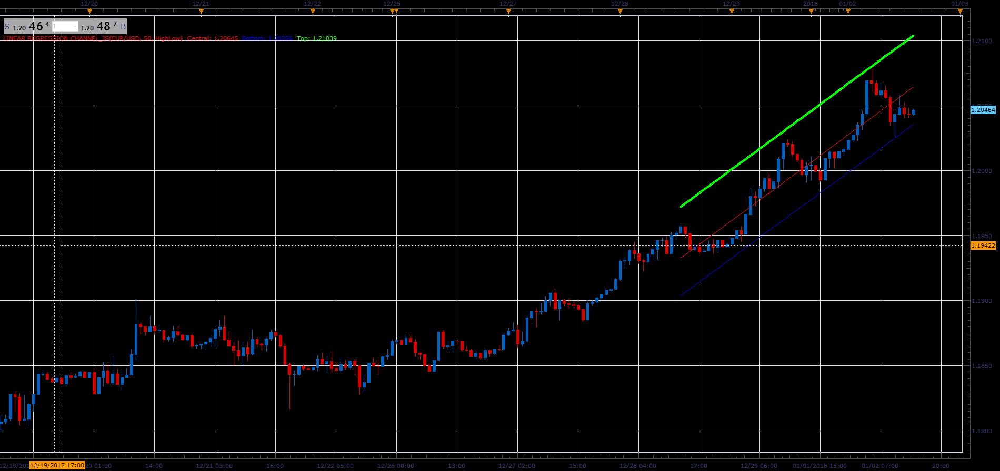

# Linear Regression Channel

> Source: https://fxcodebase.com/code/viewtopic.php?f=48&t=65558  
> Forum: 48 · Topic 65558 · 1 post(s)

---

## Linear Regression Channel

**Alexander.Gettinger** · Sat Jan 06, 2018 4:56 pm

Linear Regression Line is a straight line that best fits the prices between a starting price point and an ending price point.

The indicator has two channel modes
1) Max Distance
The distance between Linear Regression Line and Linear Regression channel,
equals to the value of maximum close price Distance from the regression line.

2)Standard deviations
Default value is one Standard deviations from central line.

 

Download:

 [Linear Regression Channel_JS.jsl](files/116837/Linear%20Regression%20Channel_JS.jsl)
