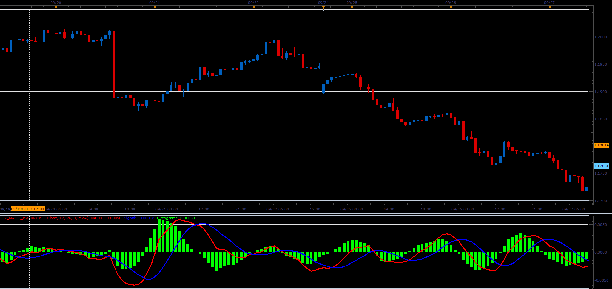

# Linear Regression MACD

> Source: https://fxcodebase.com/code/viewtopic.php?f=48&t=65225  
> Forum: 48 · Topic 65225 · 1 post(s)

---

## Linear Regression MACD

**Alexander.Gettinger** · Sat Oct 28, 2017 9:28 am

MACD = Linear Regression Line(Short period)-Linear Regression Line(Long period),
Signal = Moving average(MACD, Signal period, Signal method),
Histogram = MACD - Signal.

 

Download:

 [LR_MACD_JS.jsl](files/115649/LR_MACD_JS.jsl)
