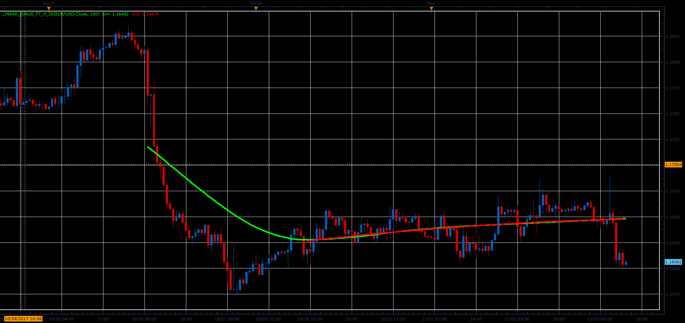

# Linear Sinus indicator

> Source: https://fxcodebase.com/code/viewtopic.php?f=48&t=65553  
> Forum: 48 · Topic 65553 · 1 post(s)

---

## Linear Sinus indicator

**Alexander.Gettinger** · Sat Jan 06, 2018 3:02 pm

The indicator uses the principle of approximation of sinusoid waves.

 

Download:

 [Linear_Sinus_FT_H_JS.jsl](files/116832/Linear_Sinus_FT_H_JS.jsl)
