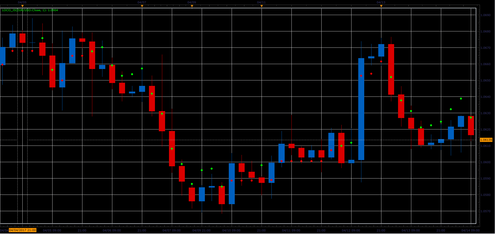

# Loco indicator

> Source: https://fxcodebase.com/code/viewtopic.php?f=48&t=64726  
> Forum: 48 · Topic 64726 · 1 post(s)

---

## Loco indicator

**Alexander.Gettinger** · Fri Jun 02, 2017 2:10 pm

Formulas:
Loco[i]=Loco[i-1], if Price[i]=Loco[i-1],
Loco[i]=Max(Loco[i-1], Price[i]*(1-K)), if Price[i-1]>Loco[i-1] and Price[i]>Loco[i-1],
Loco[i]=Price[i]*(1-K), if Price[i]>Loco[i-1],
else Loco[i]=Price[i]*(1+K), where
K=Coeff/1000.

 

Download:

 [Loco_JS.jsl](files/112715/Loco_JS.jsl)
