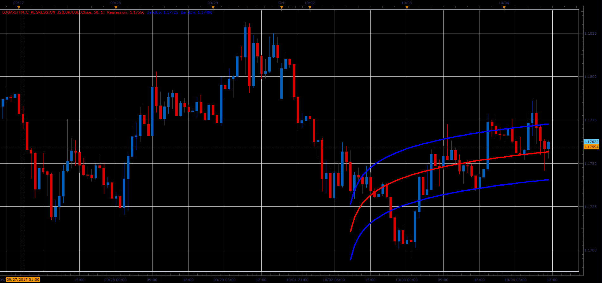

# Logarithmic regression

> Source: https://fxcodebase.com/code/viewtopic.php?f=48&t=65224  
> Forum: 48 · Topic 65224 · 1 post(s)

---

## Logarithmic regression

**Alexander.Gettinger** · Sat Oct 28, 2017 9:26 am

The indicator looks like Polynomial regression ([viewtopic.php?f=48&t=65223](https://fxcodebase.com/code/viewtopic.php?f=48&t=65223)), but instead of polynomial use a logarithmic function.

 

Download:

 [Logarithmic_Regression_JS.jsl](files/115648/Logarithmic_Regression_JS.jsl)
