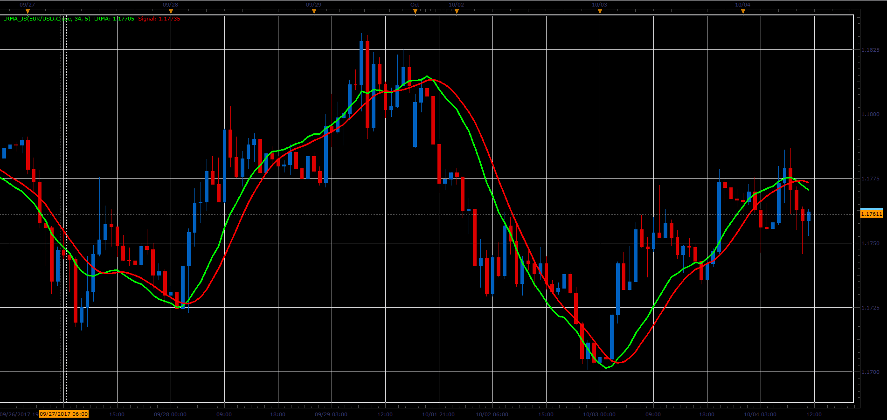

# LRMA indicator

> Source: https://fxcodebase.com/code/viewtopic.php?f=48&t=65226  
> Forum: 48 · Topic 65226 · 1 post(s)

---

## LRMA indicator

**Alexander.Gettinger** · Sat Oct 28, 2017 9:29 am

Smoothing algorithm of this moving averages based on linear regression.

LRMA=3*LWMA-2*MVA, where
LWMA - linear weighted moving average,
MVA - simple moving averages.

 

Download:

 [LRMA_JS.jsl](files/115650/LRMA_JS.jsl)
