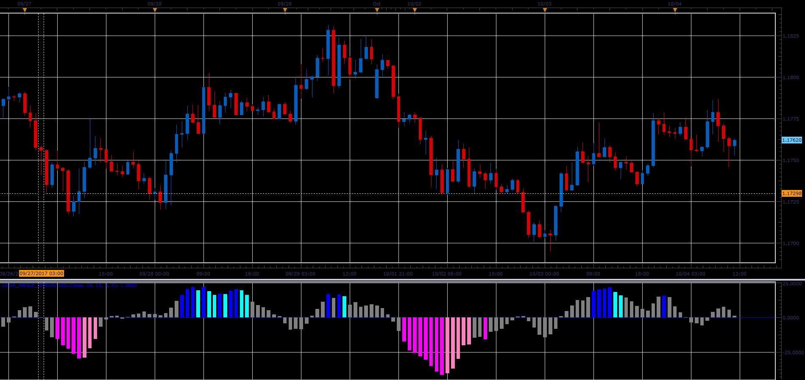

# LSMA Angle oscillator

> Source: https://fxcodebase.com/code/viewtopic.php?f=48&t=65228  
> Forum: 48 · Topic 65228 · 1 post(s)

---

## LSMA Angle oscillator

**Alexander.Gettinger** · Sat Oct 28, 2017 9:32 am

Formulas:
LSMA Angle = mFactor*(fEnd-fStart)/2, where
fEnd[i] = LSMA[i-EndShift],
fStart[i] = LSMA[i-StartShift],
mFactor = 100000/(StartShift-EndShift).

 

Download:

 [LSMA_Angle_JS.jsl](files/115652/LSMA_Angle_JS.jsl)
