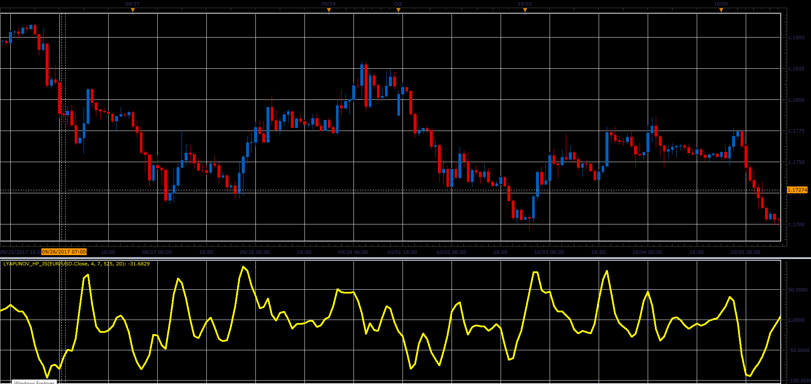

# Lyapunov HP oscillator

> Source: https://fxcodebase.com/code/viewtopic.php?f=48&t=65554  
> Forum: 48 · Topic 65554 · 5 post(s)

---

## Lyapunov HP oscillator

**Alexander.Gettinger** · Sat Jan 06, 2018 3:04 pm

Download:

 [Lyapunov_HP_JS.jsl](files/116833/Lyapunov_HP_JS.jsl)

---

## Re: Lyapunov HP oscillator

**mjf1288** · Thu Jan 23, 2025 10:37 am

Is it possible to get Lyapunov as a non-repainting lua indicator?

---

## Re: Lyapunov HP oscillator

**Apprentice** · Thu Jan 23, 2025 3:10 pm

We have added your request to the development list.
Development reference 45

---

## Re: Lyapunov HP oscillator

**mjf1288** · Wed Feb 26, 2025 9:45 am

> **Alexander.Gettinger wrote:**
>
>
> Lyapunov_HP_JS.PNG
>
>
>
> Download:
>
>
> Lyapunov_HP_JS.jsl

Is it possible to make this non-repainting, based on bar close?

---

## Re: Lyapunov HP oscillator

**Apprentice** · Thu Jun 05, 2025 2:43 pm

 [Lyapunov_HP.lua](files/159503/Lyapunov_HP.lua)
