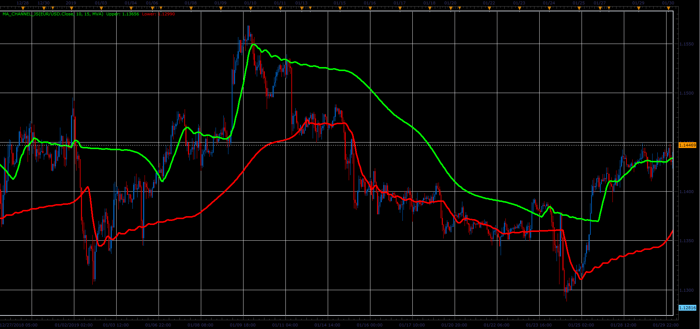

# MA Channel

> Source: https://fxcodebase.com/code/viewtopic.php?f=48&t=68232  
> Forum: 48 · Topic 68232 · 1 post(s)

---

## MA Channel

**Alexander.Gettinger** · Sat Mar 30, 2019 2:31 pm

The indicator plots moving average, and two additional average, with period that is larger and smaller from the basic moving average period for the defined Step.

 

Download:

 [MA_Channel_JS.jsl](files/125451/MA_Channel_JS.jsl)

For this indicator must be installed Averages indicator ([viewtopic.php?f=17&t=2430](https://fxcodebase.com/code/viewtopic.php?f=17&t=2430)).
