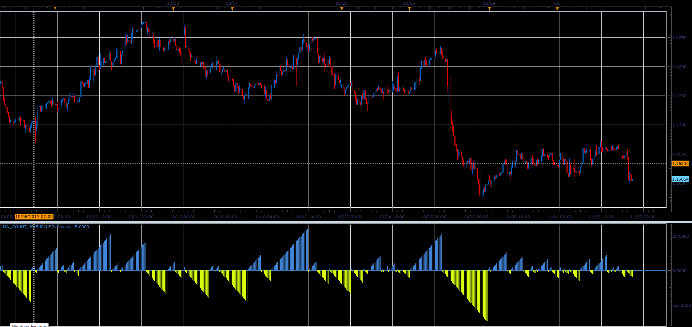

# MA Count oscillator

> Source: https://fxcodebase.com/code/viewtopic.php?f=48&t=65556  
> Forum: 48 · Topic 65556 · 1 post(s)

---

## MA Count oscillator

**Alexander.Gettinger** · Sat Jan 06, 2018 3:07 pm

The indicator resets to zero when price crossing the MA.
If Price>MA, Indicator>0,
If Price<MA, Indicator<0.

 

Download:

 [MA_Count_JS.jsl](files/116835/MA_Count_JS.jsl)
