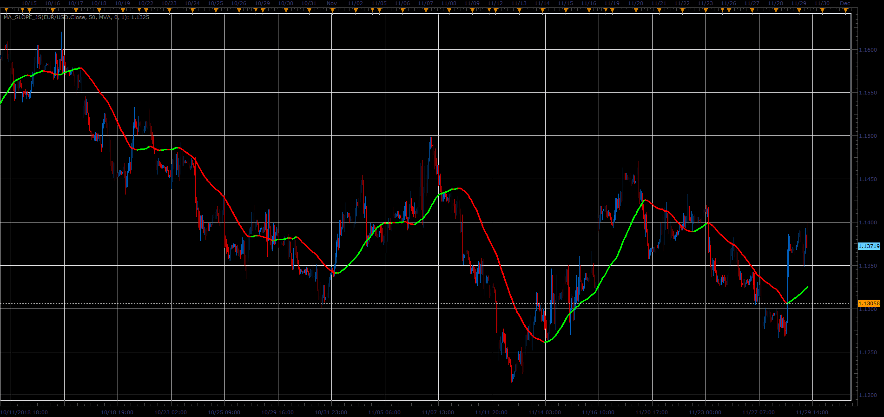

# MA Slope indicator

> Source: https://fxcodebase.com/code/viewtopic.php?f=48&t=67089  
> Forum: 48 · Topic 67089 · 1 post(s)

---

## MA Slope indicator

**Alexander.Gettinger** · Fri Dec 07, 2018 2:07 pm

Shows the slope of MA, in Pips per period.
MASO (in Pips) = ( MA[period]- MA[period-Bar] )
if MASO > Slope then Buy;
if MASO < Slope then Sell;
else Neutral.

 

Download:

 [MA_Slope_JS.jsl](files/122599/MA_Slope_JS.jsl)
