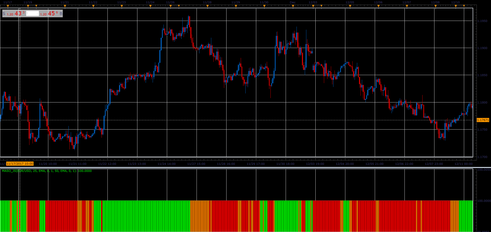

# MA Slope Oscilator

> Source: https://fxcodebase.com/code/viewtopic.php?f=48&t=65561  
> Forum: 48 · Topic 65561 · 1 post(s)

---

## MA Slope Oscilator

**Alexander.Gettinger** · Sat Jan 06, 2018 5:02 pm

This oscillator combines two MA_Slope indicators.

If both indicators have a positive slope, the indication is positive.
If both indicators have a negative slope, the indication is negative.
Distinguish contradictory, when the signals differ.
And flat, when the slope is less than the minimum.

 

Download:

 [MASO_JS.jsl](files/116840/MASO_JS.jsl)
