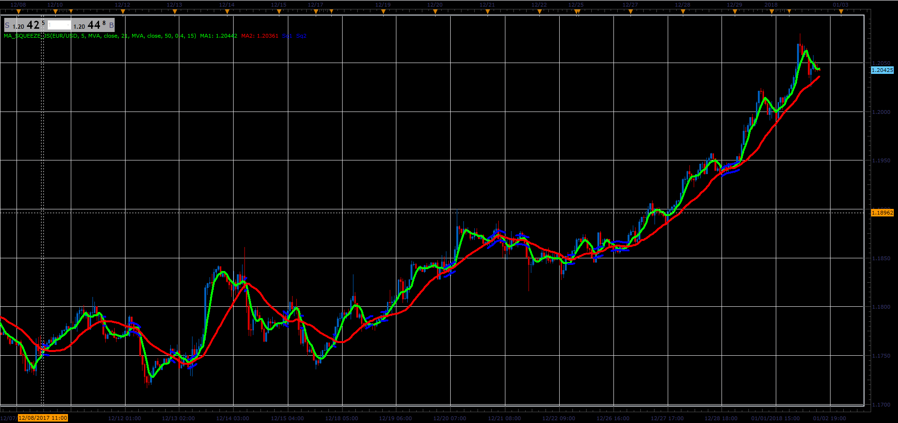

# MA Squeeze indicator

> Source: https://fxcodebase.com/code/viewtopic.php?f=48&t=65559  
> Forum: 48 · Topic 65559 · 1 post(s)

---

## MA Squeeze indicator

**Alexander.Gettinger** · Sat Jan 06, 2018 4:58 pm

The indicator draws two MA and display when they close.
Supported 2 ways of the determination squeeze: with ATR indicator and threshold in pips.

 

Download:

 [MA_Squeeze_JS.jsl](files/116838/MA_Squeeze_JS.jsl)

For this indicator must be installed AVERAGES indicator ([viewtopic.php?f=17&t=2430](https://fxcodebase.com/code/viewtopic.php?f=17&t=2430)).
