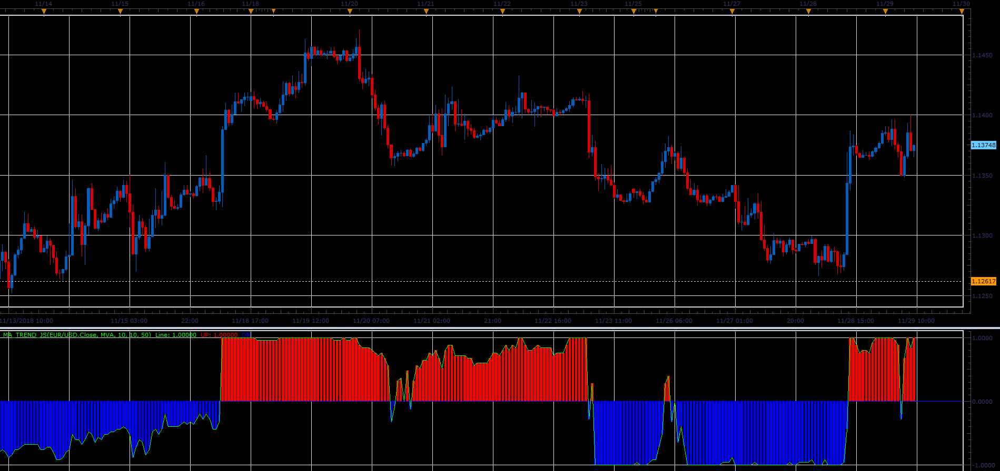

# MA Trend indicator

> Source: https://fxcodebase.com/code/viewtopic.php?f=48&t=67090  
> Forum: 48 · Topic 67090 · 1 post(s)

---

## MA Trend indicator

**Alexander.Gettinger** · Fri Dec 07, 2018 2:34 pm

Indicator analyses [Count_MA] moving averages with first period [Start_Period] and step [Step_Period].
MA_Trend=Sum(S)/Count_MA, where
S(i)=1 if Price>MA(i) and S(i)=-1 if Price<MA(i).

 

Download:

 [MA_Trend_JS.jsl](files/122601/MA_Trend_JS.jsl)

For this indicator must be installed Averages indicator ([viewtopic.php?f=17&t=2430](https://fxcodebase.com/code/viewtopic.php?f=17&t=2430)).
