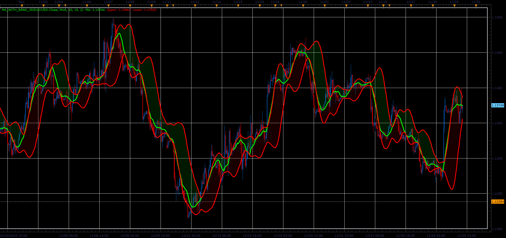

# MA with Band

> Source: https://fxcodebase.com/code/viewtopic.php?f=48&t=67091  
> Forum: 48 · Topic 67091 · 1 post(s)

---

## MA with Band

**Alexander.Gettinger** · Fri Dec 07, 2018 2:36 pm

The indicator draws the moving average and the Bollinger Bands calculated on MA.

 

Download:

 [MA_with_Band_JS.jsl](files/122602/MA_with_Band_JS.jsl)

For this indicator must be installed Averages indicator ([viewtopic.php?f=17&t=2430](https://fxcodebase.com/code/viewtopic.php?f=17&t=2430)).
