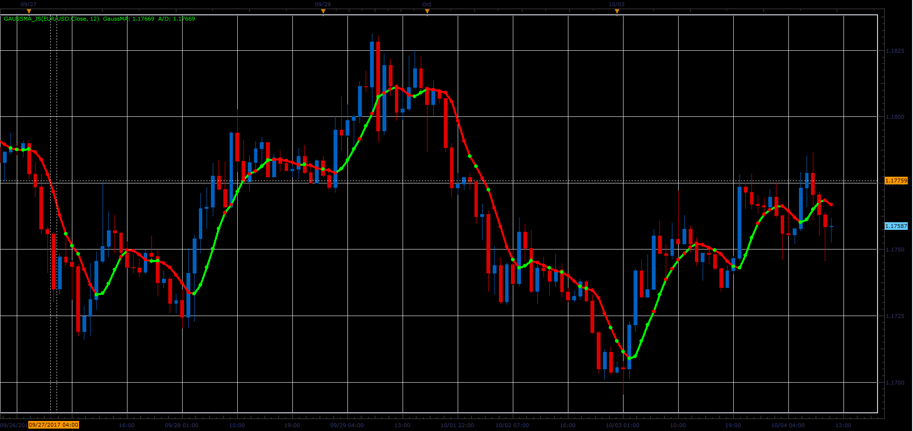

# MA with Gaussian Filter

> Source: https://fxcodebase.com/code/viewtopic.php?f=48&t=65211  
> Forum: 48 · Topic 65211 · 1 post(s)

---

## MA with Gaussian Filter

**Alexander.Gettinger** · Sat Oct 28, 2017 8:46 am

Formulas:
GaussMA[i]=p1*Price[i-1]+p2*GaussMA[i-1]-p3*GaussMA[i-2]+p4*GaussMA[i-3]-p5*GaussMA[i-4], where
p1=Alpha^4,
p2=4*(1-Alpha),
p3=6*(1-Alpha)^2,
p4=4*(1-Alpha)^3,
p5=(1-Alpha)^4,
Alpha=-Beta+sqrt(Beta*(Beta+2)),
Beta=(1-cos(w))/(2^(1/3)-1),
w=2*Pi/Period.

 

Line color indicates growth or decline.
Color of dots corresponds to the acceleration or deceleration.

Download:

 [GaussMA_JS.jsl](files/115635/GaussMA_JS.jsl)
