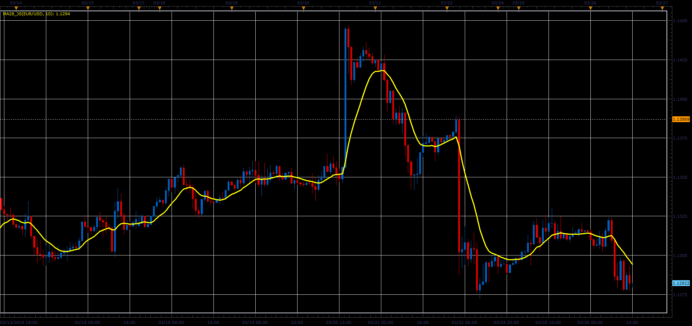

# MA28 indicator

> Source: https://fxcodebase.com/code/viewtopic.php?f=48&t=68234  
> Forum: 48 · Topic 68234 · 1 post(s)

---

## MA28 indicator

**Alexander.Gettinger** · Sat Mar 30, 2019 2:34 pm

The indicator represents the average of 28 variants moving average.

Formulas:
MA28 = (Sum_MVA+Sum_EMA+Sum_SMMA+Sum_LWMA)/28, where
Sum_MVA = MVA(Open)+MVA(Close)+MVA(High)+MVA(Low)+MVA(Median)+MVA(Typical)+MVA(Weighted),
Sum_EMA = EMA(Open)+EMA(Close)+EMA(High)+EMA(Low)+EMA(Median)+EMA(Typical)+EMA(Weighted),
Sum_SMMA = SMMA(Open)+SMMA(Close)+SMMA(High)+SMMA(Low)+SMMA(Median)+SMMA(Typical)+SMMA(Weighted),
Sum_LWMA = LWMA(Open)+LWMA(Close)+LWMA(High)+LWMA(Low)+LWMA(Median)+LWMA(Typical)+LWMA(Weighted).

 

Download:

 [MA28_JS.jsl](files/125453/MA28_JS.jsl)
