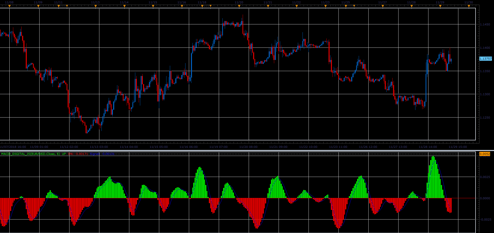

# MACD Digital

> Source: https://fxcodebase.com/code/viewtopic.php?f=48&t=67093  
> Forum: 48 · Topic 67093 · 1 post(s)

---

## MACD Digital

**Alexander.Gettinger** · Fri Dec 07, 2018 2:41 pm

This is a version MACD with digital filter.

 

Download:

 [MACD_Digital_JS.jsl](files/122604/MACD_Digital_JS.jsl)

For this indicator must be installed Averages indicator ([viewtopic.php?f=17&t=2430](https://fxcodebase.com/code/viewtopic.php?f=17&t=2430)).
