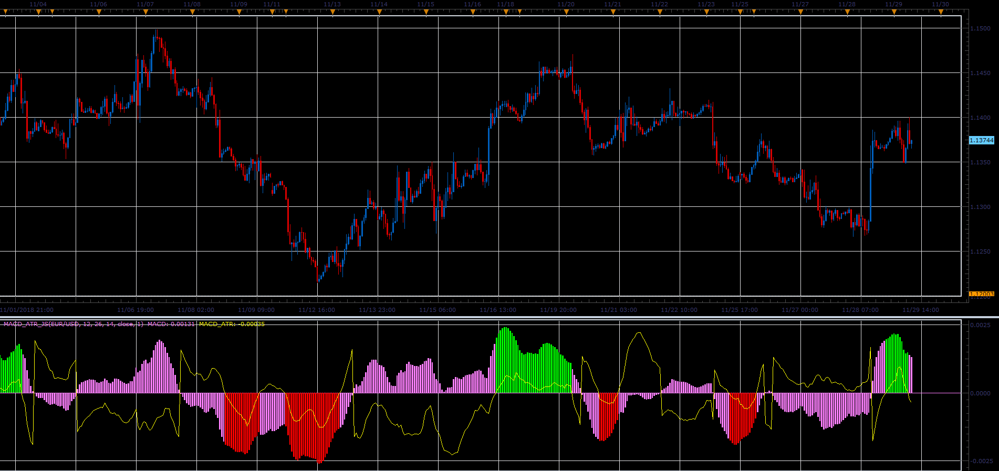

# MACD of ATR oscillator

> Source: https://fxcodebase.com/code/viewtopic.php?f=48&t=67092  
> Forum: 48 · Topic 67092 · 1 post(s)

---

## MACD of ATR oscillator

**Alexander.Gettinger** · Fri Dec 07, 2018 2:38 pm

The indicator shows the MACD adjusted for the values ATR.

Formulas:
MACD_ATR=MACD-Coeff*ATR, if MACD>0 and
MACD_ATR=MACD+Coeff*ATR, if MACD<0.

If the directions MACD and MACD_ATR are the same, MACD is in green (for positive values) or red (for negative values).

 

Download:

 [MACD_ATR_JS.jsl](files/122603/MACD_ATR_JS.jsl)
