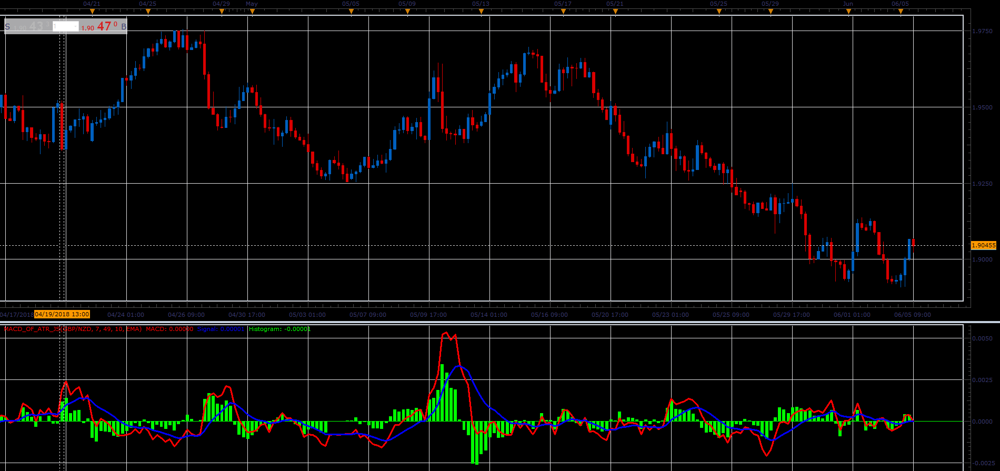

# MACD of ATR oscillator

> Source: https://fxcodebase.com/code/viewtopic.php?f=48&t=66437  
> Forum: 48 · Topic 66437 · 1 post(s)

---

## MACD of ATR oscillator

**Alexander.Gettinger** · Mon Aug 06, 2018 1:59 pm

This indicator is the MACD which, instead of two MA uses 2 ATR.

Formulas:
MACD=ATR(Short period)-ATR(Long period),
Signal=MA(MACD),
Histogram=MACD-Signal.

 

Download:

 [MACD_Of_ATR_JS.jsl](files/120369/MACD_Of_ATR_JS.jsl)

For this indicator must be installed Averages indicator ([viewtopic.php?f=17&t=2430](https://fxcodebase.com/code/viewtopic.php?f=17&t=2430)).
