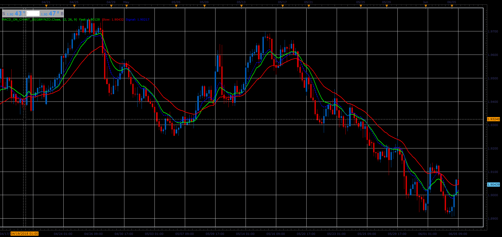

# MACD on chart

> Source: https://fxcodebase.com/code/viewtopic.php?f=48&t=66438  
> Forum: 48 · Topic 66438 · 1 post(s)

---

## MACD on chart

**Alexander.Gettinger** · Mon Aug 06, 2018 2:00 pm

Formulas:
Signal = Fast_EMA(Price)-MACD+Signal_MVA(MACD), where
MACD=Slow_EMA(Price)-Fast_EMA(Price).

 

Download:

 [MACD_On_Chart_JS.jsl](files/120370/MACD_On_Chart_JS.jsl)
