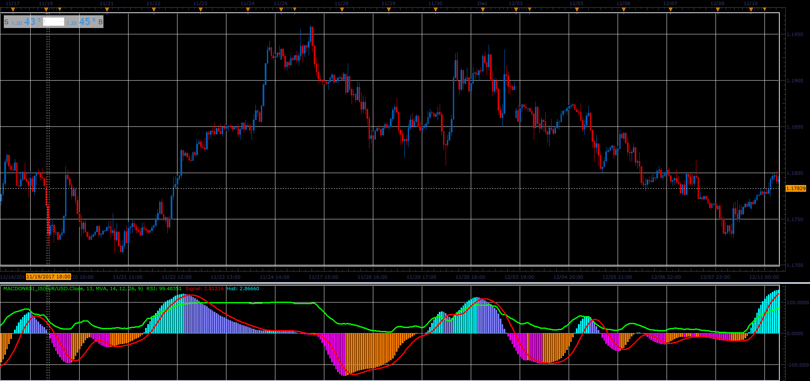

# MACD on RSI

> Source: https://fxcodebase.com/code/viewtopic.php?f=48&t=65560  
> Forum: 48 · Topic 65560 · 1 post(s)

---

## MACD on RSI

**Alexander.Gettinger** · Sat Jan 06, 2018 5:00 pm

The MACD histogram drawn on the basis of the RSI oscillator.

 

Download:

 [MACDonRSI_JS.jsl](files/116839/MACDonRSI_JS.jsl)

For this indicator must be installed Averages indicator ([viewtopic.php?f=17&t=2430](https://fxcodebase.com/code/viewtopic.php?f=17&t=2430)).
